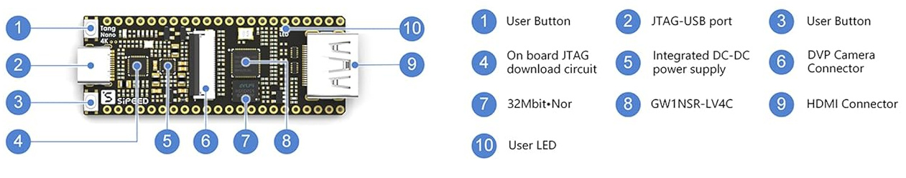
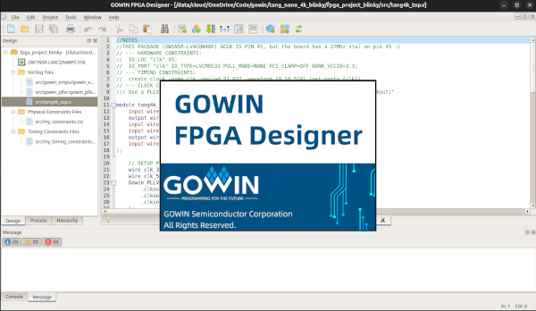
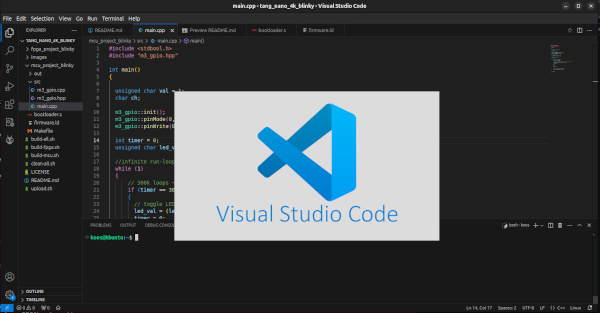
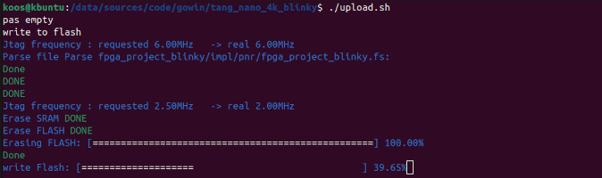
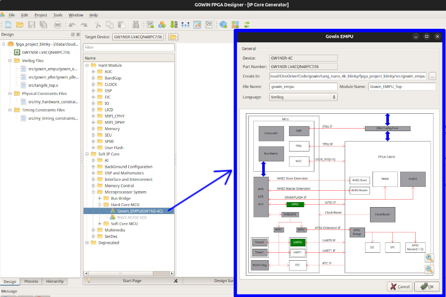
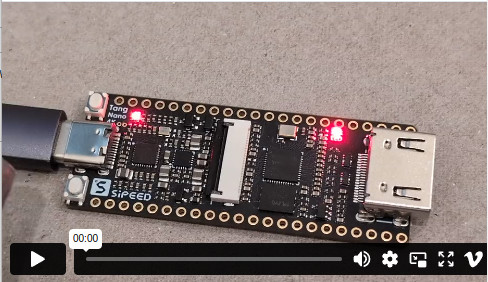

# TANG NANO 4K BLINKY

This is a basic starter project for a System On a Chip (SOC) dev board called the "Lichee Tang Nano 4K (https://wiki.sipeed.com/hardware/en/tang/Tang-Nano-4K/Nano-4K.html)

This is a super cool and relatively cheap FPGA + MCU devboard.. I bought mine for $18 from Amazon (https://www.amazon.com/gp/product/B0C6N1LPZQ)

This git repo provides a few things
- ARM Cortex M3 Bootloader written in ARM Thumb2 Assembly Language
- ARM main user program written in C++
- FGPA Project written in Verilog to setup ARM MCU and manage hardware resources.

The C++ project (mcu_project_blinky) sends to text over UART0 and flashes the onboard LED using the ARM Cortex M3 microcontroller. When Button2 is pressed, the Verilog project(fpga_project_blinky) will take over hardware and flash the LED faster using the FPGA. 

Basically this is just an introduction into FPGA and MCU integration and the Tang Nano 4K is great little device for that since it has a FPGA, a Microcontroller, SRAM, Flash, DSPs, ALUs, high speed AHB bus and more, all on the same silicon!

That said, the commuity involvement and sample projects for the TANG NANO 4K board is very sparse and I want to thank __Grug Huhler__ (https://github.com/grughuhler) for a great Youtube tutorial on this baord and I utilized his barebones GPIO driver (the official ARM codebase is massive and complex) 

The __Gowin documentation is AMAZING__, there are tons of PDF documents providing insights into the GW1NSR family of FPGAs and relation functions and features..  Go check out https://www.gowinsemi.com/en/product/detail/46/#

## HARDWARE - TANG NANO 4K

### <ins>(8) Gowin GW1NSR-LV4CQN48P - Main SOC</ins>
The board hosts a Gowin GW1NSR-LV4CQN48P chip, which is a GW1NSR series FPGA with embedded ARM Cortex M3 Microcontroller on the same chip! It sports onboard 64Mbit HyperRAM, 180Kb Block SRAM and DSP resources. The latest dataseet (DS861-1.7E, 11/22/2024 as of this writing) can be found here: https://cdn.gowinsemi.com.cn/DS861E.pdf  

### <ins>(4) Buffalo BL702 - JTAG Progamming/Debugging</ins>
The BL702 is only used for USB to JTAG for programming and debugging the GW1NSR FPGA/MCU SOC.. __This is VERY VERY dissapointing__ since this chip is actually a highly integrated BLE and zigbee combo chipset with a TON of Peripheral interfaces, which include USB2.0, IR-remote, SPI, UART, ISO 17987, I2C, I2S, PWM, QDEC, KeyScan, ADC, DAC, PIR, GPIOs and much more!!  

BOTH USB to UART ports show up when you plug it in but the UART0 and UART1 pins on the BL702 chip are not conencted and just left floating in outer space...  ARGHHHH!!!!...  Did I express my annoyance at this yet??

The fact that this chip is ONLY used for the single purpose of JTAG programming really makes me want to cry!! At No extra cost, this board could have had Bluetooth BLE, Zigbee and since it has 2x UARTS, it could even have provided Serial to USB for the Cortex M3!! That would have been awesome!!! Alas.. All pins are left unconnected, except for a lonesome few for JTAG and USB  (Insert sad crying emoji here.. )

### <ins>(7) P25Q32SH - SPI Serial Flash 32Mb</ins>
The P25Q32SH is a serial Flash memory and ikt has 32 Megabit serial flash storage and this chip is connected to FPGA via MSPI (MasterSPI). Based on the GW1NSR FPGA datasheet, it supports AUTO and DUALBOOT, which is controlled via FPGA Pin 10 (Mode), where 0 = AUTO, 1 = DUALBOOT and since Pin 10 is shared with LED and pulled down as per schematic, it means AUTO (configure from internal FGPA flash) is the default.. To enable DUALBOOT, you have to pull Pin 10 high upon power up. This will attempt to configure the FGPA from this external SPI flash first and if it fails, it will revert to Internal FPGA flash.. Pin 10 is on the dev board header, so you could pull it high on startup and force DUALBOOT.. Additionally, the FPGA has Hard IP cores for Master SPI to use the serial FLASH in your own projects..

## REQUIRED BUILD TOOLS
To build all the code for this repo, __you need TWO sets of toolchains__. One is the FPGA toolchain to build the hardware configuration bitstream for the FPGA (fpga_project_blinky) and the other is the ARM toolchain to build firmware for the ARM Cortex M3 (mcu_project_blinky)  

### <ins>FPGA Toolchain - GOWIN ® EDA:</ins>

Gowin provides a full FPGA development suite with IDE for the Gowin series of FGPAs, they have a GOWIN ® EDA "Educational" free version and a standard version, which requires a license.. The licensed version is actually also free, you just have to email them for a licenes.. which I did.. 

__Install GOWIN ® EDA:__ Download the Gowin IDE from here (After registering) : https://www.gowinsemi.com/en/support/download_eda

- __Note1__ : I use Ubuntu 24.04 and for some reason I could never get the Gowin IDE to load and I had to install "libfreetype" and then also manually do a `export LD_PRELOAD=/usr/lib/x86_64-linux-gnu/libfreetype.so` prior to running the IDE.. you could also put it into ~/.bashrc 

- __Note2__ : Please Please set your Gowin install path in the `build-fpga.sh` script. You can also refer to the script for details on exporting libfreetype..  

### <ins>ARM Cortex M3 Toolchain - VSCode and ARM C++ Compiler:</ins>

To build the code for the ARM Cortex M3, you would need the ARM build toolchain and I use Visual Studio Code to edit the source code.

__Install ARM toolchain:__ `sudo apt install gcc-arm-none-eabi` _(There is a newer versoin on ARM website you can install manually, but this one works fine for me..)_

__Install Visual Studio Code:__ Download and Install the .DEB from https://code.visualstudio.com/download

## BUILDING THE BINARIES
There are two binaries that need to be built. The one is the FPGA hardware configuration bitstream for the FGPA and the other is the Firmware for the ARM Cortex M3, which consists of a Bootloader and user program to execute.

### <ins>Building FPGA Configuration Bitstream:</ins>
There are two ways you can build the FPGA binary. The first one is manually opening the fpga_blinky_project in the Gowin IDE and clicking the "Run All" button in the toolbar.. The other way is to call the Gowin shell from and use a script to automate the process.  

Both of these methods work fine and I wrote a small bash script called `build-fpga.sh` to automate it.. just call it from a terminal window and it will build the Bistream binary for you and output it to `fpga_project_blinky/impl/pnr/fpga_projec_blinky.fs`

__Build FPGA Bitsream:__ `./build-fpga.sh` _(This calls the Gowin toolset and auto builds the Bitstream for you)_

- __Note1__ : Edit the `build-fpga.sh` file and update `GOWIN_BIN` variable to point to where you installed the Gowin IDE.

### <ins>Building MCU Firmware:</ins>
The ARM Cortex M3 Firmware is build by simply calling `make` in the `mcu_project_blinky` directory.  This will build the Bootloader and the main user program and finally link it all into a single ELF file and finally convert it to a BIN that can be uploaded to the FLASH rom.
__Build Firmware:__ `./build-mcu.sh` _(This will make the C++ project and output the firmware.bin file for you)_

### <ins>Building ALL at once:</ins>
I created a single script that will build the FPGA and the MCU binaries all in one go.. 

__Build All:__ `./build-all.sh` _(This will build FPGA and MCU projects and output BOTH the Bitstream and firmware binaries)_

## Flashing the TANG NANO FGPA and MCU
After the required binaries are built, you can upload the FPGA Bitstream and MCU Firmware to the Gowin chip via the onboard USB-JTAG capability. This is  done either through the Gowin Programmer tools or you can use openFPGALoader.

### <ins>Upload using Gowin Programmer:</ins> 
You can use the Gowin programmer that comes with the GOWIN ® EDA software, although I found it to be very unlreliable on my Ubuntu machine.. sometines it would flash only the FPGA and other times it would flash the FPGA and the MCU and sometimes only the MCU and sometimes neither..

If you want to use this toolset, I would recommend you program it using the MCU mode first.. then do it again using FPGA flash mode.. 

### <ins>Upload using openFGPALoader (Recommended):</ins> 

The most reliable solution I found was using openFPGALoader. It will upoad the Bitstream to the FPGA configuration FLASH and FPGA RAM plus it will upload the MCU firmware to the MCU flash. Generally this is the preferred solution..

openFPGALoader can not only flash this board, it can actually flash a wide range of FPGA boards and I am using this to flash my Xiling and Altera FPGA dev boards without a hitch.. really great to see they added Tang Nano 4K support.

__Installing openFPGALoader:__  `sudo apt install openfpgaloader` _(This will install openFPGALoader, but you might need to also install some ftdi library if it complains)_

__Upload using openFPGALoader:__  `openFPGALoader -b tangnano4k -f fpga_project_blinky/impl/pnr/fpga_project_blinky.fs --mcufw mcu_project_blinky/out/firmware.bin` _(You can also just upload using the script `./upload.sh`)_

## THE CODE
As you are probably well aware by now, there are two projects.. one for the GW1NSR FPGA and another for the ARM Cortex M3.. Below is a high level breakdown of the code and what it does.

### <ins>fpga_project_blinky (Verilog HDL)</ins>
This is a HDL (Hardware Description Language) project using the Verilog language. There are 3x main components in any HDL project, which I will briefly explain below.

__Timing Constraints:__ `src/my_timing_constraints.sdc`  
- This is file defines how the clock supplied to the FPGA is constructed.. the TANG NANO 4K has a 27Mhz oscillator onboard and connected to the GW1NSR's Pin 45 
- The timing constraint defines the input clock with period of 37.037 nano seconds, resulting in 27Mhz 

__Hardware Constraints:__ `src/my_hardware_constraints.cst`  
- This file defines all how all the pins of the FPGA are connected and how you will be using them in your project, including pull-ups, voltage rails, logic levels, etc. Its worthhile noting the schematic shows all the inputs menthoned below are externally pulled down.
- The input clock is defined as `xtal` and connected to FPGA Pin 45 and using 3.3v CMOS signals
- The onboard LED is defined as `led` and connected to FPGA Pin 10 and using 3.3v CMOS signals
- The two onboard Buttons 1 and 2 are defined as `key1` and `key2` and connected to FPGA Pins 14 and 15 with 1.8v CMOS signals 
- The `uart0_txd` and `uart0_rxd` pins to be passed through to the ARM Cortex M3's UART0

__Verilog TOP Module:__ `src/tang4k_top.v`
- There must be one .v file that ends in _top in your project. The tooling will make that your main Verilog file when synthesizing.. thats why this one is called `tang4k_top.v` (emphasis on the ___top__ part)
- This is the main Verilog code file and the parameters flowing into the `module tang4k_top` should be 1 to 1 match what is declared in your Hardware Constraints. again the module naming must also end in ___top__ to make this the main entry point for your Verilog project
- The instantiation of the `Gowin_EMPU_Top` module is to create the scaffolding for the ARM Cortex M3 and wiring up the MCU's clock and other peripherals like GPIO and UART.. This code is generated automatically when using Gowin IDE's Core IP Generator.  (Details below)
- The main logic of this Verilog code module sits in the `always @(posedge clk_324) ` block. This is where a timer loop will toggle a LED buffer ON and OFF every 250ms and if Button2 is pushed, the physical LED will be mapped to the buffer and the LED will flash ON and OFF for as long as the button is held down.
- IMPORTANT : While Button2 is NOT pressed, the M3's GPIO[0] will be mapped to the physical LED, so the M3 has control over the LED while Button2 is NOT being held down.
- When Button2 is pressed, the FPGA will also set an M3 GPIOP[1] pin high so the ARM Cortex M3 can read it.

__Gowin_EMPU:__ `src/gowin_empu/*` _(Enable the ARM Cortex M3 and map FPGA resources to MCU)_
- Everything in this folder is autogenerated by the Gowin IDE's Core IP Generator when selecting: `Soft IP Core` >> `Microprocessor System` >> `Hard-Core-MCU` >> `Gowin_EMPU(GW1NS-4C)`
- __You do NOT have to re-generate it__, but if you wan to see how its done, you can double click on the GPIO block to enable it and do the same with the UART0 block and configure each.. This will generate the template code thats already inserted into the project..
- As a matter of interrest, all the dark grey blocks are by default internally mapped, i.e. the FLASH/Clock/APB/Reset

## <ins>mcu_project_blinky (C++)</ins>
This project is the ARM Cortex M3 firmware project, which is mainly using C++ for all the user program code. It has 3 major components to it, the Bootloader (assembly code), the main program (C++) and the Linker script to glue it all together.

__Bootloader:__ `bootloader.s` _(ARM Thumb2 Assembly language)_
- The code has two major functions. The first is to setup the Interrupt Vector Table, which are the addresses of the functions that will handle Interrupts to the system. Secondly, this code contains a small ARM-Thumb2 Assembly Language based Bootloader program to intialize SRAM and handover control to the main user program.
- The "Reset" interrupt will be activated for Power-On and Reset signals (i.e reset button pushes). So __this is the primary entrypoint for the M3 to run code__
- The "Reset" interrupt handler address points to the `_start` Assembly code function, so when the board gets powers (or reset), then the M3 will automatically jump to the `_start` function.
- Note - ALL the other interrupt handlers point to a function with a `while(true)` infintte loop.. i.e. no other interrupts are handled.
- The Assembly code `_start` function just copies all the global and static variable initialization values from FLASH into SRAM and zeros out the part of SRAM that holds non-initialized global and static variables.
- After global and staic variables are initialized, it jump to the C++ `main()` function

__User "main" Program__ `src/main.cpp` _(C++ code)_
- This is the main C++ program code that will be called from the Bootloader when the board is powered on, or Reset is button is pushed.
- The primary C++ code is to setup the M3's GPIO and turn the GPIO[0] ON and OFF roughly 2 every 500ms
- So - When the Verilog code is not asserting control over the LED, the M3's C++ code will have control and flash the LED.. But as soon as Button2 is pressed, the Verilog code will take over the LED mapping until Button2 is released.

__Linker Script__ `firmware.ld`
- This is the linked script that will be finally used to put all the intermediate outputs together from the Assembler Bootloader code to the C++ main program and organize it in such a way so it could be uploaded to the ARM Cortex M3 flash.
- Linker script defines the FLASH and SRAM offsets and sizes for where to put everything
- Defines the locations for code storage and execution as well as varaibles/data storage locations
- These locations are important for the Bootloader to know where to copy data from/to

## RUNNING THE CODE!!

Once the FPGA Bitstream and MCU Firmware has been uploaded, the code on the ARM Cortex M3 should automatically start to run and blink the LED about 2x per second.. Then when you press and hold Button2, the FPGA will take over the LED and flash it faster at about 4x per second!!

TADAA!! You now have a SOC with embedded FPGA and Microntroller running at the same time, sharing hardware!

I have to say, this was probably the MOST amount of code I have ever had to write to blink an LED :) But, hey, this is just the start and the core scaffolding for more to come!!

Click on the image or link below to see what it looks like in action..

